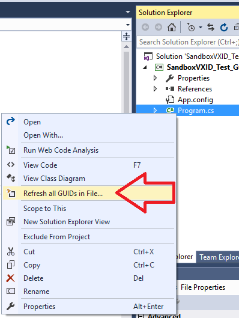

# NewGuidVSExt

<!-- Replace this badge with your own-->

<!-- Update the VS Gallery link after you upload the VSIX-->
Download this extension from the [VS Gallery](https://visualstudiogallery.msdn.microsoft.com/[GuidFromGallery])
or get the [CI build](http://vsixgallery.com/extension/b3baec7f-1087-44f7-bd6d-bca6c0ef8ace/).

---------------------------------------

Right click into a file and get all the GUIDs into that file refreshed.

See the [change log](CHANGELOG.md) for changes and road map.

## Change all GUIDs in selected file(s)
- Right-click on any file(s) on Solution explorer
- Select the "ChangeRefresh all GUIDs in File..." option in the context menu.
- All the GUIDs inside the selected file(s) be refresh with newly created ones.
- VS might ask you to refresh the file.

## Contribute
Check out the [contribution guidelines](CONTRIBUTING.md)
if you want to contribute to this project.

For cloning and building this project yourself, make sure
to install the
[Extensibility Tools 2015](https://visualstudiogallery.msdn.microsoft.com/ab39a092-1343-46e2-b0f1-6a3f91155aa6)
extension for Visual Studio which enables some features
used by this project.

## License
[Apache 2.0](LICENSE)